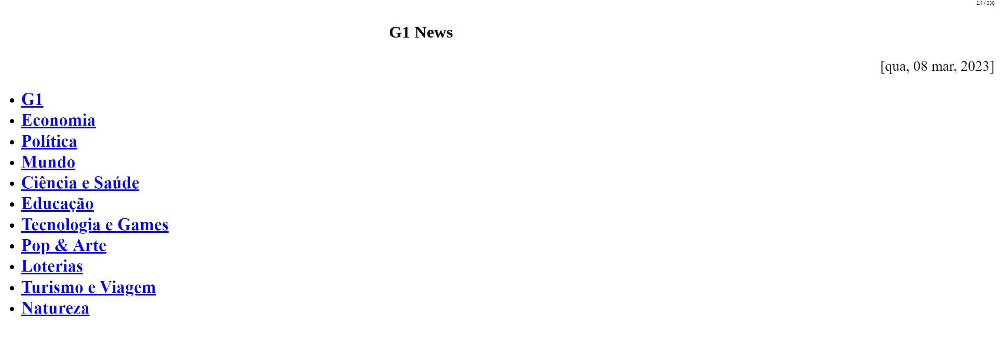

# G1 News for Calibre
This is a recipe for Calibre which allows you to download [G1](https://g1.globo.com) news into a ebook using Calibre.

### Installation
1. Download the recipe file from the releases page.
2. Open Calibre.
3. Click on the little down arrow in the "Fetch News" button on the top bar -> Add or edit a custom news source -> Load recipe from File and select the 'g1.recipe' file you downloaded.
5. Click on "Fetch News" button on the top bar -> Custom -> G1 News -> Download Now.
